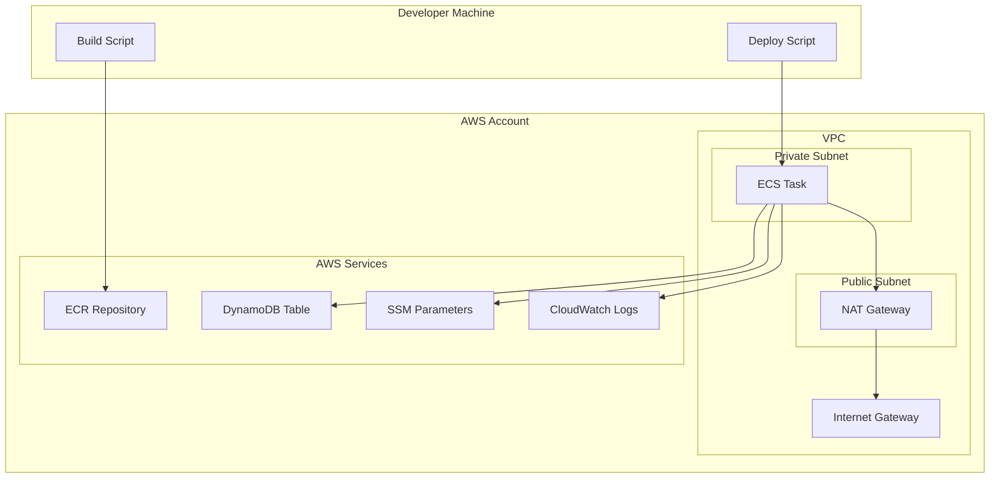

# AWS ECS Deployment Design Document

## Overview

This design document outlines the architecture and implementation approach for deploying the DynamoDB Load Test application to AWS using ECS (Elastic Container Service). The solution provides a complete infrastructure-as-code approach using CloudFormation templates, with enhanced build and deployment scripts supporting AWS profiles and ECR integration.

## Architecture

### High-Level Architecture



### Component Architecture

1. **Infrastructure Layer**: VPC, subnets, NAT Gateway, security groups
2. **Container Layer**: ECR repository, ECS cluster, task definitions
3. **Application Layer**: Load test application with AWS service integrations
4. **Monitoring Layer**: CloudWatch Logs, task monitoring
5. **Security Layer**: IAM roles, security groups, least-privilege access

## Components and Interfaces

### 1. CloudFormation Templates

#### Main Infrastructure Template (`cloudformation/infrastructure.yaml`)

- **Purpose**: Creates VPC, networking, and core AWS resources
- **Resources**:
  - VPC with CIDR block
  - Public and private subnets
  - Internet Gateway and NAT Gateway
  - Route tables and associations
  - Security groups for ECS tasks
  - ECR repository
  - CloudWatch Log Groups

#### ECS Template (`cloudformation/ecs.yaml`)

- **Purpose**: Creates ECS cluster, task definitions, and IAM roles
- **Resources**:
  - ECS Cluster
  - ECS Task Definition with container specifications
  - IAM Task Role with DynamoDB, SSM, and CloudWatch permissions
  - IAM Execution Role for ECS task management

#### DynamoDB Template (`cloudformation/dynamodb.yaml`)

- **Purpose**: Creates DynamoDB table with appropriate configuration
- **Resources**:
  - DynamoDB table with configurable capacity
  - Global Secondary Indexes if needed

### 2. Enhanced Build Script

#### ECR Integration (`scripts/build-app.sh`)

- **New Features**:
  - `--push-ecr` flag to enable ECR push
  - `--aws-profile` parameter for AWS authentication
  - `--ecr-repository` parameter for repository specification
  - Automatic ECR login and image tagging
  - Multi-architecture build support

#### Build Process Flow

1. Build Docker image locally
2. Authenticate with ECR using AWS profile
3. Tag image with ECR repository URI
4. Push image to ECR
5. Output image URI for deployment

### 3. Enhanced Deployment Script

#### AWS Profile Support (`scripts/deploy-stack.sh`)

- **New Features**:
  - `--aws-profile` parameter for authentication
  - Environment-specific parameter file loading
  - CloudFormation stack dependency management
  - Rollback capabilities

#### Deployment Process Flow

1. Validate AWS credentials and profile
2. Load environment-specific parameters
3. Deploy infrastructure stack
4. Deploy ECS stack with dependencies
5. Update SSM parameters
6. Validate deployment success

### 4. Container Configuration

#### Dockerfile Enhancements

- Multi-stage build for optimized image size
- Non-root user for security
- Health check endpoint
- Proper signal handling for graceful shutdown

#### Environment Variables

- AWS region configuration
- DynamoDB table name from SSM
- CloudWatch log group configuration
- Application-specific parameters

## Data Models

### CloudFormation Parameters

```yaml
# Infrastructure Parameters
VpcCidr: "10.0.0.0/16"
PrivateSubnetCidr: "10.0.1.0/24"
PublicSubnetCidr: "10.0.2.0/24"
AvailabilityZone: "us-east-1a"

# ECS Parameters
TaskCpu: 256
TaskMemory: 512
ContainerPort: 8080

# Application Parameters
TableName: "dynamodb-load-test"
LogRetentionDays: 7
```

### SSM Parameter Structure

```
/aws/dynamodb-load-test/
├── table-name
├── concurrency-limit
├── total-items
├── max-concurrency-percentage
├── inject-duplicates
├── cleanup-after-test
├── read-capacity-units
└── write-capacity-units
```

### IAM Policy Structure

```json
{
  "Version": "2012-10-17",
  "Statement": [
    {
      "Effect": "Allow",
      "Action": [
        "dynamodb:GetItem",
        "dynamodb:PutItem",
        "dynamodb:DeleteItem",
        "dynamodb:Scan",
        "dynamodb:Query"
      ],
      "Resource": "arn:aws:dynamodb:*:*:table/dynamodb-load-test*"
    },
    {
      "Effect": "Allow",
      "Action": [
        "ssm:GetParameter",
        "ssm:GetParameters",
        "ssm:GetParametersByPath"
      ],
      "Resource": "arn:aws:ssm:*:*:parameter/aws/dynamodb-load-test/*"
    },
    {
      "Effect": "Allow",
      "Action": ["logs:CreateLogStream", "logs:PutLogEvents"],
      "Resource": "arn:aws:logs:*:*:log-group:/aws/ecs/dynamodb-load-test*"
    }
  ]
}
```

## Error Handling

### Build Script Error Handling

- **ECR Authentication Failures**: Retry with exponential backoff
- **Image Push Failures**: Validate network connectivity and permissions
- **AWS Profile Issues**: Provide clear error messages and resolution steps

### Deployment Script Error Handling

- **CloudFormation Failures**: Automatic rollback with detailed error reporting
- **Parameter Validation**: Pre-deployment validation of all required parameters
- **Dependency Issues**: Check for required AWS services and permissions

### Runtime Error Handling

- **AWS Service Unavailability**: Implement retry logic with circuit breaker pattern
- **Network Issues**: Graceful degradation and error reporting
- **Resource Limits**: Proper error messages for capacity constraints

## Testing Strategy

### Unit Testing

- CloudFormation template validation using cfn-lint
- Script parameter validation testing
- IAM policy validation

### Integration Testing

- End-to-end deployment testing in development environment
- ECS task execution validation
- AWS service integration testing

### Security Testing

- IAM role permission validation
- Network security group testing
- Container security scanning

### Performance Testing

- ECS task startup time optimization
- Network throughput validation
- Cost optimization analysis

## Deployment Considerations

### Environment Management

- **Development**: Single AZ deployment for cost optimization
- **Production**: Multi-AZ deployment for high availability
- **Testing**: Ephemeral environments with automatic cleanup

### Cost Optimization

- **ECS Fargate Spot**: Use Spot instances for non-critical workloads
- **Resource Right-sizing**: Optimize CPU and memory allocation
- **Log Retention**: Appropriate retention policies for cost control

### Security Considerations

- **Network Isolation**: Private subnets with controlled internet access
- **Least Privilege**: Minimal IAM permissions for task execution
- **Encryption**: Enable encryption at rest and in transit
- **Secrets Management**: Use AWS Secrets Manager for sensitive data

### Monitoring and Observability

- **CloudWatch Metrics**: ECS task metrics and custom application metrics
- **CloudWatch Alarms**: Automated alerting for failures and performance issues
- **AWS X-Ray**: Distributed tracing for performance analysis
- **Cost Monitoring**: AWS Cost Explorer integration for cost tracking

## Migration Strategy

### Phase 1: Infrastructure Setup

1. Create CloudFormation templates
2. Enhance build and deployment scripts
3. Test in development environment

### Phase 2: Application Integration

1. Update application for AWS service integration
2. Implement CloudWatch logging
3. Test ECS task execution

### Phase 3: Production Deployment

1. Deploy to production environment
2. Validate all functionality
3. Update documentation and runbooks

### Rollback Plan

- CloudFormation stack rollback capabilities
- Previous image version deployment
- Local development environment fallback
