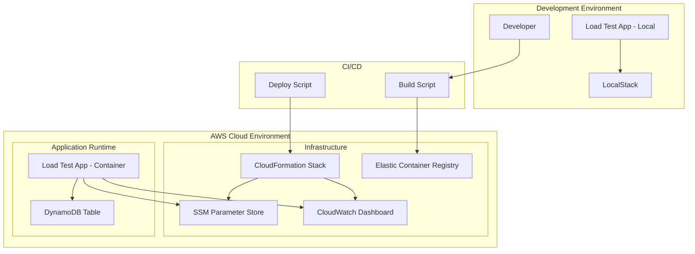
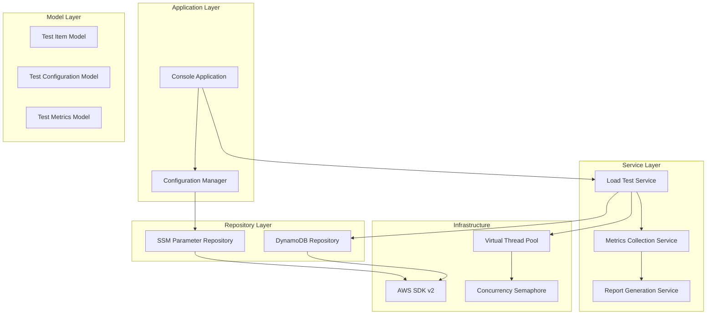

# Design Document

## Overview

The DynamoDB Load Test system is designed as a cloud-native application that performs comprehensive load testing against DynamoDB tables. The system consists of two main components: a Java Spring Boot console application for executing load tests, and CloudFormation infrastructure for deployment, configuration management, and monitoring.

The application uses modern Java features including Virtual Threads for high-concurrency operations, AWS SDK v2 for cloud service integration, and a layered architecture for maintainability. The system supports both local development with LocalStack and production deployment on AWS.

## Architecture

### High-Level Architecture



### Application Architecture

The application follows a layered architecture pattern:



## Components and Interfaces

### Model Layer

#### TestItem

```java
public class TestItem {
    private String primaryKey;
    private String payload;
    private Instant timestamp;
    private Map<String, Object> attributes;
}
```

#### TestConfiguration

```java
public class TestConfiguration {
    private String tableName;
    private int concurrencyLimit;
    private int totalItems;
    private double maxConcurrencyPercentage;
    private boolean injectDuplicates;
    private String environment;
}
```

#### TestMetrics

```java
public class TestMetrics {
    private Duration responseTime;
    private int successCount;
    private int errorCount;
    private Map<String, Integer> errorTypes;
    private int concurrencyLevel;
    private Instant timestamp;
}
```

### Repository Layer

#### DynamoDBRepository

```java
public interface DynamoDBRepository {
    CompletableFuture<PutItemResponse> putItem(TestItem item);
    CompletableFuture<Boolean> tableExists(String tableName);
}
```

#### SSMParameterRepository

```java
public interface SSMParameterRepository {
    CompletableFuture<String> getParameter(String parameterName);
    CompletableFuture<Map<String, String>> getParametersByPath(String path);
}
```

### Service Layer

#### LoadTestService

```java
public interface LoadTestService {
    CompletableFuture<TestResult> executeLoadTest(TestConfiguration config);
    CompletableFuture<Void> executeWithConcurrency(List<TestItem> items, int concurrency);
}
```

#### MetricsCollectionService

```java
public interface MetricsCollectionService {
    void recordMetric(TestMetrics metric);
    TestSummary generateSummary();
    void publishToCloudWatch(TestMetrics metrics);
}
```

### Application Layer

#### LoadTestApplication

```java
@SpringBootApplication
public class LoadTestApplication {
    public static void main(String[] args);
}
```

#### ConfigurationManager

```java
@Component
public class ConfigurationManager {
    TestConfiguration loadConfiguration();
    boolean isLocalEnvironment();
}
```

## Data Models

### DynamoDB Table Schema

```yaml
TableName: ${Environment}-load-test-table
PartitionKey:
  Name: pk
  Type: String
Attributes:
  - payload (String)
  - timestamp (String)
  - test_run_id (String)
  - concurrency_level (Number)
```

### SSM Parameter Structure

```yaml
Parameters:
  /${Environment}/dynamodb-load-test/table-name: String
  /${Environment}/dynamodb-load-test/concurrency-limit: String
  /${Environment}/dynamodb-load-test/total-items: String
  /${Environment}/dynamodb-load-test/max-concurrency-percentage: String
  /${Environment}/dynamodb-load-test/inject-duplicates: String
```

### CloudWatch Metrics

```yaml
Namespace: DynamoDBLoadTest
Metrics:
  - ResponseTime (Milliseconds)
  - ErrorRate (Percent)
  - ThroughputRPS (Count/Second)
  - ConcurrencyLevel (Count)
  - CapacityErrors (Count)
  - DuplicateKeyErrors (Count)
```

## Error Handling

### Error Categories

1. **DynamoDB Capacity Errors**

   - ProvisionedThroughputExceededException
   - RequestLimitExceededException
   - Retry with exponential backoff

2. **Duplicate Key Errors**

   - ConditionalCheckFailedException (when using conditional puts)
   - Track and report separately

3. **Configuration Errors**

   - Missing SSM parameters
   - Invalid configuration values
   - Fail fast with clear error messages

4. **Network/Service Errors**
   - Connection timeouts
   - Service unavailable
   - Implement circuit breaker pattern

### Error Handling Strategy

```java
@Component
public class ErrorHandler {
    public void handleDynamoDBError(Exception e, TestMetrics metrics);
    public boolean shouldRetry(Exception e, int attemptCount);
    public Duration calculateBackoff(int attemptCount);
}
```

## Testing Strategy

### Unit Tests

1. **Model Layer Tests**

   - Validation logic
   - Data transformation
   - Serialization/deserialization

2. **Service Layer Tests**

   - Business logic validation
   - Concurrency control
   - Metrics calculation
   - Mock external dependencies

3. **Repository Layer Tests**
   - AWS SDK integration (mocked)
   - Parameter parsing
   - Error handling

### Integration Tests

1. **LocalStack Integration**

   - End-to-end flow with LocalStack
   - DynamoDB operations
   - SSM parameter retrieval

2. **Configuration Tests**

   - Environment detection
   - Parameter loading
   - Configuration validation

3. **Concurrency Tests**
   - Virtual thread behavior
   - Semaphore limits
   - Load test execution

### Test Configuration

```yaml
Test Profiles:
  - unit: Mock all external dependencies
  - integration-local: Use LocalStack
  - integration-aws: Use real AWS services (CI/CD only)
```

## Infrastructure Design

### CloudFormation Template Structure

```yaml
Resources:
  # SSM Parameters
  TableNameParameter:
    Type: AWS::SSM::Parameter

  ConcurrencyLimitParameter:
    Type: AWS::SSM::Parameter

  # DynamoDB Table
  LoadTestTable:
    Type: AWS::DynamoDB::Table

  # CloudWatch Dashboard
  LoadTestDashboard:
    Type: AWS::CloudWatch::Dashboard

  # IAM Roles
  LoadTestExecutionRole:
    Type: AWS::IAM::Role
```

### Environment Configuration

```bash
# .env.local
ENVIRONMENT=local
AWS_ENDPOINT_URL=http://localhost:4566
TABLE_NAME=local-load-test-table

# .env.prod
ENVIRONMENT=prod
AWS_REGION=us-east-1
TABLE_NAME=prod-load-test-table
```

## Deployment Strategy

### Build Process

1. Maven compilation and packaging
2. Docker image creation
3. Optional ECR upload with version tagging
4. CloudFormation stack deployment

### Container Strategy

```dockerfile
FROM openjdk:21-jdk-slim
COPY target/demo-dynamodb-load-test.jar app.jar
ENTRYPOINT ["java", "--enable-preview", "-jar", "/app.jar"]
```

### Deployment Scripts

1. **deploy-stack.sh**: CloudFormation deployment
2. **build-app.sh**: Application build and containerization
3. **start-container.sh**: Local container execution
4. **stop-container.sh**: Container cleanup
