# DynamoDB Load Test

A comprehensive load testing application for Amazon DynamoDB built with Java 21, Spring Boot, and AWS SDK v2. This application performs high-concurrency write operations to test DynamoDB performance, scalability, and behavior under various load conditions.

## Table of Contents

- [🎯 Purpose](#-purpose)
- [🏗️ Architecture](#️-architecture)
  - [Application Architecture](#application-architecture)
  - [Infrastructure Architecture](#infrastructure-architecture)
- [🚀 Quick Start](#-quick-start)
  - [Prerequisites](#prerequisites)
  - [Complete Local Development Workflow](#complete-local-development-workflow)
  - [Complete AWS Deployment Workflow](#complete-aws-deployment-workflow)
- [📋 Simplified Scripts](#-simplified-scripts)
  - [Core Scripts](#core-scripts)
  - [Usage Examples](#usage-examples)
  - [Script Features](#script-features)
- [🔧 Configuration](#-configuration)
  - [Environment Variables](#environment-variables)
  - [Load Test Patterns](#load-test-patterns)
- [📊 Monitoring](#-monitoring)
  - [CloudWatch Metrics](#cloudwatch-metrics)
  - [Logs](#logs)
  - [Dashboard](#dashboard)
- [🔍 Troubleshooting](#-troubleshooting)
  - [Common Issues](#common-issues)
  - [Debug Mode](#debug-mode)
- [🤝 Contributing](#-contributing)
  - [Development Workflow](#development-workflow)

## 🎯 Purpose

This application provides a comprehensive solution for load testing Amazon DynamoDB with the following capabilities:

- **High-Concurrency Testing**: Simulate thousands of concurrent write operations
- **Configurable Load Patterns**: Control concurrency, item count, and test duration
- **Performance Metrics**: Detailed CloudWatch metrics and custom dashboards
- **Automated Cleanup**: Optional cleanup of test data after completion
- **Multi-Environment Support**: Local development with LocalStack and AWS deployment
- **Infrastructure as Code**: Complete CloudFormation templates for reproducible deployments

## 🏗️ Architecture

### High-Level Architecture

```mermaid
graph TB
    subgraph "Development Environment"
        Dev[👨‍💻 Developer]
        LocalStack[🐳 LocalStack<br/>DynamoDB + SSM]
        DevApp[📱 Load Test App<br/>Local Container]
    end

    subgraph "AWS Cloud Environment"
        subgraph "🏗️ Infrastructure"
            CF[☁️ CloudFormation<br/>Stack]
            SSM[🔧 SSM Parameter<br/>Store]
            CW[📊 CloudWatch<br/>Dashboard & Logs]
            ECR[📦 Elastic Container<br/>Registry]
        end

        subgraph "🌐 VPC Network"
            subgraph "Private Subnet"
                ECS[🚀 ECS Fargate<br/>Task]
            end
            subgraph "Public Subnet"
                NAT[🌐 NAT Gateway]
            end
            IGW[🌍 Internet Gateway]
        end

        subgraph "💾 Data & Storage"
            DDB[⚡ DynamoDB<br/>Table]
        end
    end

    subgraph "🔄 CI/CD Pipeline"
        Build[🔨 Build Script<br/>build.sh]
        Deploy[🚀 Deploy Script<br/>deploy-stack.sh]
        Run[▶️ Run Script<br/>run.sh]
    end

    %% Development Flow
    Dev --> Build
    Build --> DevApp
    DevApp --> LocalStack
    
    %% AWS Deployment Flow
    Build --> ECR
    Deploy --> CF
    CF --> SSM
    CF --> CW
    CF --> ECS
    Run --> ECS
    
    %% Runtime Connections
    ECS --> SSM
    ECS --> DDB
    ECS --> CW
    ECS --> NAT
    NAT --> IGW
    
    %% Styling
    classDef aws fill:#FF9900,stroke:#232F3E,stroke-width:2px,color:#fff
    classDef dev fill:#4CAF50,stroke:#2E7D32,stroke-width:2px,color:#fff
    classDef script fill:#2196F3,stroke:#1565C0,stroke-width:2px,color:#fff
    
    class CF,SSM,CW,ECR,ECS,DDB,NAT,IGW aws
    class Dev,LocalStack,DevApp dev
    class Build,Deploy,Run script
```



### Application Architecture

- **Java 21** with Virtual Threads for high-concurrency operations
- **Spring Boot 3.5.5** for application framework and dependency injection
- **AWS SDK v2** for DynamoDB operations with async client
- **CloudWatch** integration for metrics and monitoring
- **Docker** containerization for consistent deployments

### Infrastructure Architecture

- **Amazon ECS Fargate** for serverless container execution
- **Amazon DynamoDB** as the target database for load testing
- **Amazon VPC** with public/private subnets for network isolation
- **AWS Systems Manager (SSM)** for parameter management
- **Amazon CloudWatch** for logging and monitoring
- **Amazon ECR** for container image storage

## 🚀 Quick Start

### Prerequisites

- **Java 21** - Download from [Eclipse Temurin](https://adoptium.net/)
- **Gradle/Maven** - Build tool (Gradle wrapper included)
- **Docker** - [Get Docker](https://docs.docker.com/get-docker/)
- **AWS CLI** - [Installation Guide](https://docs.aws.amazon.com/cli/latest/userguide/getting-started-install.html)
- **jq** - JSON processor: `brew install jq` (macOS) or `apt-get install jq` (Ubuntu)

### Complete Local Development Workflow

**Step 1: Setup Project**

```bash
# Clone the repository
git clone <repository-url>
cd dynamodb-load-test
```

**Step 2: Ensure LocalStack is Running**

This setup assumes you already have LocalStack running on your system for other projects. If not, start it:

```bash
# Start LocalStack container for local AWS services (if not already running)
docker run --rm -d -p 4566:4566 --name localstack localstack/localstack

# Verify LocalStack is running and has required services
curl http://localhost:4566/_localstack/health
```

**Step 3: Configure Local Environment**

The `.env.local` file contains all configuration needed for local development:

```bash
# Review and customize .env.local file
cat .env.local

# Key settings for local development:
# - TABLE_NAME=local-load-test-table
# - CONCURRENCY_LIMIT=10 (adjust as needed)
# - TOTAL_ITEMS=25 (adjust as needed)
# - AWS_ENDPOINT_URL=http://localhost:4566 (for host scripts)
# - AWS_ENDPOINT_URL_CONTAINER=http://host.docker.internal:4566 (for containers)
```

**Step 4: Build Application**

```bash
# Test and build application with Docker image
./scripts/build.sh local

# Or skip tests if needed
./scripts/build.sh local --skip-tests
```

**Step 5: Setup LocalStack Infrastructure (Optional)**

If you want to setup the infrastructure separately or verify the setup:

```bash
# Run setup script independently (reads from .env.local)
./scripts/setup-localstack.sh

# This configures:
# - DynamoDB table (local-load-test-table) with specified capacity
# - SSM parameters with all configuration values
# - Uses your existing LocalStack instance
```

**Step 6: Run Load Test**

```bash
# Run complete local environment with log streaming
./scripts/run.sh local --logs

# Or run in background
./scripts/run.sh local
```

This will automatically:

1. **Setup Infrastructure**: Run the setup script that reads from `.env.local` and configures:

   - DynamoDB table (`local-load-test-table`) with specified capacity
   - SSM parameters with all configuration values
   - Uses your existing LocalStack instance

2. **Run Application**: Launch the containerized application that:
   - Connects to your existing LocalStack instance
   - Reads configuration from SSM parameters
   - Executes the load test
   - Generates performance reports
   - Cleans up test data (if enabled)

**Step 7: Monitor Results**

```bash
# View application logs
docker logs dynamodb-load-test-app

# Check DynamoDB table
aws dynamodb describe-table --table-name local-load-test-table --endpoint-url http://localhost:4566

# View SSM parameters
aws ssm get-parameters-by-path --path "/local/dynamodb-load-test" --endpoint-url http://localhost:4566

# List items in table (if cleanup is disabled)
aws dynamodb scan --table-name local-load-test-table --endpoint-url http://localhost:4566
```

**Step 8: Cleanup (Optional)**

```bash
# Stop application container
docker-compose down

# Clean up LocalStack resources (optional)
aws dynamodb delete-table --table-name local-load-test-table --endpoint-url http://localhost:4566
```

**Local Development Features:**

- ✅ **Uses Existing LocalStack**: Leverages your existing LocalStack instance instead of creating a new one
- ✅ **Configuration from File**: All settings read from `.env.local` for easy customization
- ✅ **Automated Setup**: Single script configures DynamoDB table and SSM parameters
- ✅ **Docker Compose Integration**: Simplified container orchestration
- ✅ **Real-time Logs**: Stream application logs during execution
- ✅ **Performance Reports**: Detailed metrics and analysis
- ✅ **Cleanup Support**: Optional cleanup of test data after completion

### Complete AWS Deployment Workflow

**Step 1: Setup AWS Credentials**

```bash
# Configure AWS CLI with your credentials
aws configure --profile your-profile-name

# Or use existing profile
export AWS_PROFILE=your-profile-name

# Verify credentials
aws sts get-caller-identity --profile your-profile-name
```

**Step 2: Configure AWS Environment**

```bash
# Create your AWS environment file from template
cp .env.template .env.aws

# Edit .env.aws file with your specific values
vim .env.aws

# Key settings to customize:
# - AWS_PROFILE: Your AWS profile name
# - AWS_REGION: Your preferred AWS region
# - TABLE_NAME: DynamoDB table name (default: aws-dynamodb-load-test)
# - CONCURRENCY_LIMIT: Adjust based on your needs
# - TOTAL_ITEMS: Number of items to write
# - TASK_CPU/TASK_MEMORY: ECS task resources

# ⚠️ IMPORTANT: Never commit .env.aws to version control!
# It contains your AWS profile and configuration
```

**Step 3: Setup S3 Bucket for Templates**

```bash
# Create S3 bucket for CloudFormation templates
./scripts/setup-stack.sh aws create --aws-profile your-profile-name

# This will:
# - Create S3 bucket with versioning and encryption
# - Upload CloudFormation templates
# - Configure bucket security settings
```

**Step 4: Build and Deliver Application**

```bash
# Build application, create Docker image, and push to ECR
./scripts/build.sh aws --aws-profile your-profile-name

# This will:
# - Run tests
# - Build Java application
# - Create Docker image
# - Login to ECR
# - Push image to ECR repository
```

**Step 5: Deploy AWS Infrastructure Stack**

```bash
# Deploy complete AWS infrastructure
./scripts/deploy-stack.sh aws create --aws-profile your-profile-name

# This creates:
# - VPC with public/private subnets
# - DynamoDB table
# - ECS cluster and task definition
# - IAM roles and policies
# - CloudWatch log groups
# - ECR repository

# Check deployment status
./scripts/deploy-stack.sh aws status --aws-profile your-profile-name
```

**Step 6: Run Load Test**

```bash
# Run ECS task with log streaming and wait for completion
./scripts/run.sh aws --aws-profile your-profile-name --wait --logs

# Or run without waiting
./scripts/run.sh aws --aws-profile your-profile-name

# This will:
# - Update SSM parameters with latest config
# - Launch ECS Fargate task
# - Stream CloudWatch logs (if --logs specified)
# - Wait for completion (if --wait specified)
```

**Step 7: Monitor Results**

```bash
# View CloudWatch dashboard (created automatically)
aws cloudwatch get-dashboard --dashboard-name "aws-DynamoDB-Load-Test-Dashboard" --profile your-profile-name

# Check DynamoDB table metrics
aws dynamodb describe-table --table-name aws-dynamodb-load-test --profile your-profile-name

# View recent logs
aws logs tail /aws/ecs/aws-dynamodb-load-test --follow --profile your-profile-name
```

**Step 8: Cleanup (When Done)**

```bash
# Destroy all AWS infrastructure
./scripts/destroy-stack.sh aws --aws-profile your-profile-name

# Or destroy without confirmation prompts
./scripts/destroy-stack.sh aws --aws-profile your-profile-name --force

# This removes:
# - CloudFormation stacks
# - DynamoDB tables
# - ECS resources
# - ECR images
# - SSM parameters
# - CloudWatch log groups
```

## 📋 Simplified Scripts

The project now includes **4 simplified scripts** that handle all automation needs:

### Core Scripts

| Script                              | Purpose                              | Local | AWS |
| ----------------------------------- | ------------------------------------ | ----- | --- |
| **`./scripts/setup-localstack.sh`** | Setup LocalStack DynamoDB & SSM      | ✅    | ❌  |
| **`./scripts/setup-stack.sh`**      | Setup S3 bucket for templates        | ❌    | ✅  |
| **`./scripts/build.sh`**            | Test, build, and deliver application | ✅    | ✅  |
| **`./scripts/deploy-stack.sh`**     | Deploy/update infrastructure stack   | ✅    | ✅  |
| **`./scripts/run.sh`**              | Run application (Docker Compose/ECS) | ✅    | ✅  |
| **`./scripts/destroy-stack.sh`**    | Destroy infrastructure stack         | ✅    | ✅  |

### Usage Examples

#### LocalStack Setup Script

```bash
# Setup LocalStack DynamoDB table and SSM parameters (reads from .env.local)
./scripts/setup-localstack.sh

# This creates:
# - DynamoDB table with configured capacity
# - SSM parameters with all configuration values
# - Uses existing LocalStack instance on localhost:4566
```

#### Setup Script

```bash
# Create S3 bucket for templates (LocalStack)
./scripts/setup-stack.sh local create

# Create S3 bucket for templates (AWS)
./scripts/setup-stack.sh aws create --aws-profile prod

# Check bucket status
./scripts/setup-stack.sh aws status --aws-profile prod

# Upload templates only (if bucket exists)
./scripts/setup-stack.sh aws upload-templates --aws-profile prod
```

#### Build Script

```bash
# Test and build for local development
./scripts/build.sh local

# Test, build, and deliver to ECR for AWS
./scripts/build.sh aws --aws-profile prod

# Build without running tests
./scripts/build.sh aws --skip-tests
```

#### Deploy Stack Script

```bash
# Deploy LocalStack infrastructure
./scripts/deploy-stack.sh local create

# Update AWS infrastructure
./scripts/deploy-stack.sh aws update --aws-profile prod

# Check infrastructure status
./scripts/deploy-stack.sh aws status
```

#### Run Script

```bash
# Run container locally with logs
./scripts/run.sh local --logs

# Run ECS task in AWS and wait for completion
./scripts/run.sh aws --aws-profile prod --wait --logs

# Run ECS task without waiting
./scripts/run.sh aws --aws-profile prod
```

#### Destroy Stack Script

```bash
# Destroy LocalStack infrastructure
./scripts/destroy-stack.sh local

# Destroy AWS infrastructure with confirmation
./scripts/destroy-stack.sh aws --aws-profile prod

# Destroy without confirmation prompts
./scripts/destroy-stack.sh aws --force
```

### Script Features

**Build Script (`build.sh`)**

- Runs application tests
- Builds application (Gradle/Maven)
- Creates Docker image
- Delivers image to ECR (AWS only)
- Options: `--skip-tests`, `--skip-build`, `--skip-delivery`

**Deploy Stack Script (`deploy-stack.sh`)**

- Syncs CloudFormation parameters from environment files
- Uploads templates to S3 (AWS only)
- Creates or updates CloudFormation stacks
- Shows infrastructure status
- Actions: `create`, `update`, `status`

**Run Script (`run.sh`)**

- Updates SSM parameters before running (AWS only)
- Runs Docker container locally
- Launches ECS tasks in AWS
- Streams logs during execution
- Options: `--wait`, `--logs`, `--container-name`

**Destroy Stack Script (`destroy-stack.sh`)**

- Stops and removes local containers
- Deletes CloudFormation stacks
- Cleans up SSM parameters (AWS)
- Cleans up ECR images (AWS)
- Options: `--force`

## 🔧 Configuration

### Environment Variables

The application uses environment-specific configuration files:

- **`.env.local`** - LocalStack development settings
- **`.env.aws`** - AWS deployment settings

Key configuration parameters:

| Parameter                    | Description                   | Default                  |
| ---------------------------- | ----------------------------- | ------------------------ |
| `TABLE_NAME`                 | DynamoDB table name           | `aws-dynamodb-load-test` |
| `CONCURRENCY_LIMIT`          | Maximum concurrent operations | `100`                    |
| `TOTAL_ITEMS`                | Total items to write          | `10000`                  |
| `MAX_CONCURRENCY_PERCENTAGE` | Percentage at max concurrency | `80.0`                   |
| `INJECT_DUPLICATES`          | Inject duplicate keys         | `false`                  |
| `CLEANUP_AFTER_TEST`         | Clean up test data            | `true`                   |

### Load Test Patterns

The application supports different load testing patterns:

1. **Ramp-up Pattern**: Gradually increase concurrency
2. **Sustained Load**: Maintain constant concurrency
3. **Burst Pattern**: Short bursts of high concurrency
4. **Mixed Workload**: Combination of read/write operations

## 📊 Monitoring

### CloudWatch Logs

Application logs are automatically captured and sent to CloudWatch:

- **Local**: Docker container logs (`docker logs dynamodb-load-test-app`)
- **AWS**: CloudWatch Logs (`/aws/ecs/dynamodb-load-test`)

### CloudWatch Dashboard

A CloudWatch dashboard is automatically created with:

- **DynamoDB Metrics**: Read/write capacity, throttling, system errors
- **ECS Task Metrics**: CPU utilization, memory usage, task status
- **Log-based Metrics**: Application errors, capacity errors, duplicate key errors (via metric filters)

### Application Metrics

The application collects detailed internal metrics:

- **Response Times**: Average, percentiles (p50, p90, p95, p99)
- **Success/Error Rates**: Operation success and failure statistics
- **Error Categorization**: Capacity exceeded, duplicate keys, throttling, network errors
- **Concurrency Tracking**: Metrics per concurrency level
- **Throughput**: Operations per second

These metrics are logged in structured JSON format and displayed in the final test report.

## 🔒 Security

### Environment Configuration Security

This repository follows security best practices for credential management:

**✅ Safe to commit:**

- `.env.local` - Contains only dummy LocalStack credentials
- `.env.template` - Template with placeholder values
- All source code and infrastructure templates

**❌ Never commit:**

- `.env.aws` - Contains your real AWS profile and settings
- Any files with actual AWS credentials or account information

**Setup Process:**

```bash
# 1. Copy template to create your AWS config
cp .env.template .env.aws

# 2. Edit with your actual values
vim .env.aws

# 3. Verify it's gitignored (should not appear in git status)
git status
```

See [SECURITY.md](SECURITY.md) for detailed security guidelines.

## 🔍 Troubleshooting

### Common Issues

**Permission Errors**

```bash
# Check IAM policy allows DynamoDB operations
aws iam get-role-policy --role-name aws-dynamodb-load-test-execution-role --policy-name aws-dynamodb-load-test-dynamodb-policy
```

**Table Name Mismatch**

```bash
# Verify table name in SSM matches actual table
aws ssm get-parameter --name "/dynamodb-load-test/table-name"
aws dynamodb list-tables --query 'TableNames[?contains(@, `dynamodb-load-test`)]'
```

**ECS Task Failures**

```bash
# Check ECS task logs
aws logs tail /aws/ecs/dynamodb-load-test --follow
```

### Debug Mode

Enable debug logging by setting:

```bash
export LOGGING_LEVEL_ROOT=DEBUG
```

## 🤝 Contributing

1. Fork the repository
2. Create a feature branch
3. Make your changes
4. Add tests for new functionality
5. Run the test suite: `./scripts/build.sh local`
6. Submit a pull request

### Development Workflow

```bash
# Setup development environment
./scripts/deploy-stack.sh local create

# Make changes and test
./scripts/build.sh local
./scripts/run.sh local --logs

# Clean up
./scripts/destroy-stack.sh local
```

---

**Note**: This simplified script structure replaces the previous complex set of scripts. The new approach provides clear separation of concerns and easier maintenance while supporting both local development and AWS deployment scenarios.
